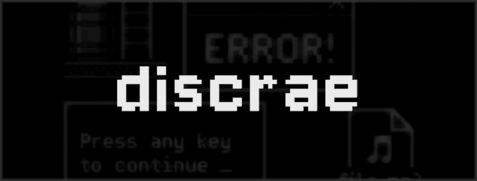
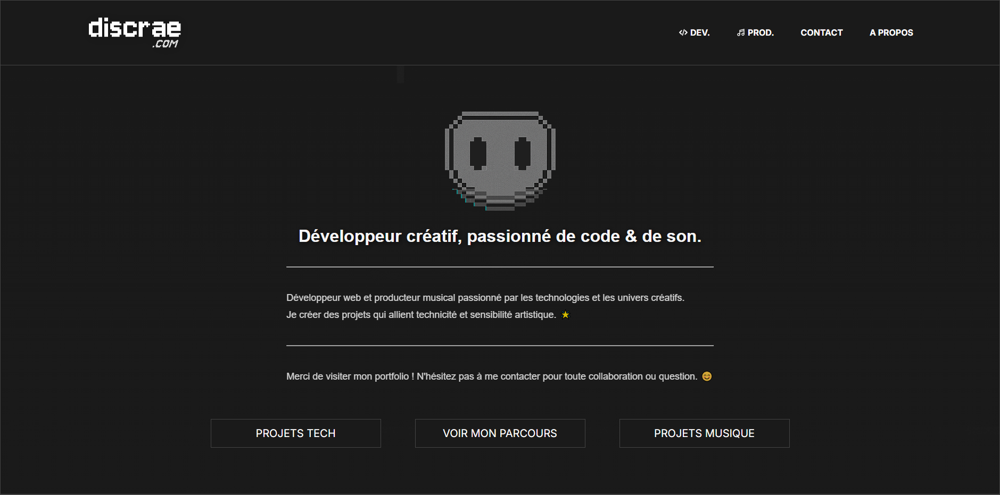
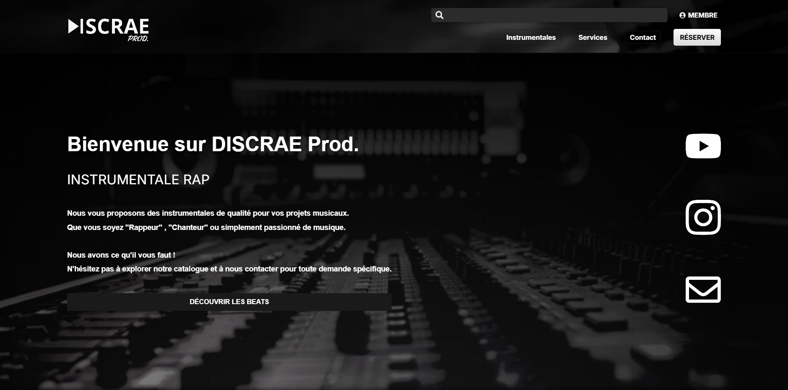
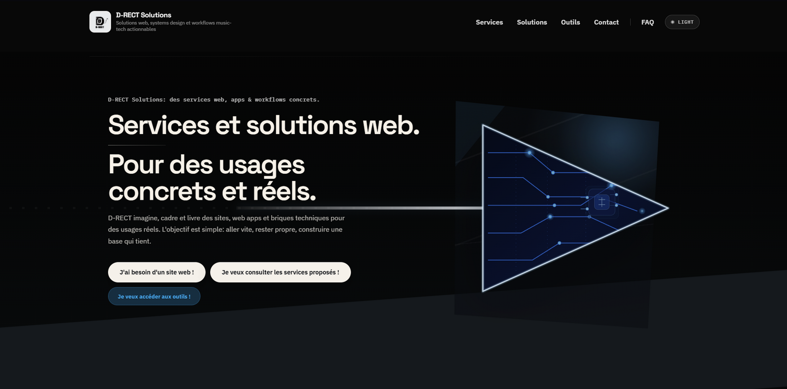

# **Discrae** 👋

  
<strong> English Version — Open Full Profile</strong>

---

  ## 🙋 About Me

  Welcome to my GitHub profile.

  I am a **web developer** and **music producer**, passionate about technology and creativity, with a product-oriented approach focused on method, quality, and clarity. 🎨💻🎶

  My background combines a **scientific and computer-focused education (NSI, Mathematics, Economics)**, higher education in **audio and sound**, an **independent self-taught** music production practice, and a web development specialization validated by the **Développeur Web et Web Mobile** professional title. 🌟

  ### 🎓 My Background

  - Scientific and computer-focused school background
  - Higher education in audio, sound, and technical production
  - Independent and self-taught beatmaking and music production practice
  - Specialization in web development
  - Professional certification as a Web and Mobile Web Developer

  ---

  

    
<strong>🔎 Current Research & Ongoing Watch</strong>

    *Quick overview of the topics I actively follow and work on.*

  - **Modern fullstack web**  
    React + Vite, Node.js / Express, application architecture, testing, and cloud deployment.
  - **APIs and product tooling**  
    Gmail API, Google Drive API, Stripe, YouTube Data API, SSR / CSR, Swagger / OpenAPI, i18n.
  - **DevOps, quality, and security**  
    GitHub Actions, WSL Ubuntu + SSH, Docker, logging, monitoring, and OWASP-oriented practices.
  - **Standards and compliance**  
    OWASP, W3C, GDPR / PCI-DSS, ISO-related standards, validation, and document reliability.
  - **PDF and document cryptography**  
    PDF/A, Factur-X, VeraPDF, electronic signatures, metadata, timestamping, and traceability.
  - **AI applied to development**  
    GitHub Copilot (IDE + CLI), Claude / Claude Code, prompt engineering, and assisted workflows.
  - **Local AI and privacy-first thinking**  
    Local AI with a pragmatic view of real limits: hardware, VRAM, context, and versatility.
  - **Knowledge systems and documentation engineering**  
    Private documentation repository, interactive second brain, and traceable, verifiable documentation.

  

  

    
<strong>🧭 What I am currently deepening the most</strong>

    *The areas where I currently invest the most effort.*

  - **Staying strongly practice-oriented**  
    Learning through real projects, documenting methods, and turning what I learn into reusable processes.
  - **Building more reliable applications**  
    With a real focus on security, documentation, and maintainability.
  - **Going deeper into less usual topics**  
    Document compliance, electronic signatures, PDF-oriented cryptography, and knowledge systems.
  - **Bringing development, documentation, and AI assistance together**  
    To build useful workflows without removing human validation.

  

  *I enjoy creating digital and sound experiences that combine design, performance, and accessibility.*  
  *If you want to know more, feel free to contact me for any collaboration or question.*

  ### ⚡ Quick Access

  - > 📺 **My online portfolio**: [Discrae.com](https://www.discrae.com)
  - > 🎧 **My online instrumental platform**: [DISCRAEProd.com](https://www.discraeprod.com)

  ---

  ## 🧑‍💻 My Projects

  ### 1. 💻 **[Discrae.com](https://www.discrae.com) - Personal Portfolio**
  

    
  

  Personal portfolio dedicated to my web projects and music productions, with a focus on performance and accessibility.

  **Main features**:
  - Clear presentation of my web and music projects
  - Responsive design with polished animations
  - Secure contact form through Gmail API
  - Clean structure between frontend, backend, content, and deployment

  ---

  ### 2. 🎧 **[DISCRAEProd.com](https://www.discraeprod.com) - Online Instrumental Catalog**
  

    
  

  A platform dedicated to music production, designed to discover, listen to, and reserve original instrumentals.

  **Main features**:

  - Demo listening
  - Music license reservation
  - File download
  - Secure sign-up and sign-in
  - Business API integrations: **Stripe**, **Gmail**, and **Google Drive**
  - Fullstack product logic with **cloud MySQL**, CI/CD, SEO, and application security

  ---

  ### 3. 💼 **D-RECT Solutions - Business Solution / Professional Project**
  

    
  

  A business-oriented project designed to structure, present, and highlight a professional activity.

  **Main features**:

  - Clear presentation of services and project identity
  - Modern, responsive, and accessible web interface
  - Scalable base for content, contact, and business use cases

  ---

  ## 🧰 Complementary Projects

  <table>
    <tr>
      <td width="50%" valign="top">
        <h3>1. 🎼 Beat/Song Sheet Generator</h3>
        

          
        

        
A tool designed to speed up content structuring around music production, with an automation- and productivity-oriented mindset.

        
<strong>Main features:</strong>

        <ul>
          <li>Generation of sheets or work structures for music projects</li>
          <li>Centralization of useful information for composition and organization</li>
          <li>Practical base for evolving assisted production workflows</li>
          <li>Experiments around <strong>parsing</strong>, <strong>PDF</strong> generation, and metadata</li>
        </ul>
      </td>
      <td width="50%" valign="top">
        <h3>2. 📄 PP.PDF</h3>
        

          
        

        
A technical exploration project focused on PDF generation and validation, with an approach oriented toward compliance and traceability.

        
<strong>Main features:</strong>

        <ul>
          <li>PDF generation with business logic and metadata control</li>
          <li>Compliance validation around <strong>PDF/A</strong> and <strong>Factur-X</strong></li>
          <li>Exploration of electronic signatures, hashing, PKI, and CMS formats</li>
          <li>Document verification with <strong>VeraPDF</strong> in a quality / audit-oriented logic</li>
        </ul>
      </td>
    </tr>
  </table>

  ---

  ## 🧠 Tech Stack

  ### Core Stack

  | Category  | Main technologies                   |
  |-----------|-------------------------------------|
  | **Programming languages** |  /  /  |
  | **Markup & styling languages** |  /  /  |
  | **Frontend** |  /  |
  | **Backend** |  /  |
  | **Databases** |  /  |
  | **Tools** |  /  /  /  |
  | **Terminal & environment** |  /  /  /  |
  | **Testing** |  /  /  |
  | **CI/CD / DevOps** |  /  |
  | **Deployment / Production** |  *(frontend)* /  *(backend)* /  /  |

  ---

  ### Complementary Ecosystem

  | Category  | Tools, integrations, and references |
  |-----------|-------------------------------------|
  | **Libs & middleware** |  /  /  /  |
  | **Security / Auth** |  /  /  /  |
  | **APIs & integrations** |  /  /  /  /  |
  | **AI / Automation** |  /  /  |

  ---

  ### Documentation & References

  | Category  | References, architecture, and principles |
  |-----------|------------------------------------------|
  | **Documentation & architecture** | Swagger / OpenAPI / i18n / SSR / CSR / DRY / KISS / SoC |
  | **Standards & references** | OWASP / W3C / GDPR / PCI-DSS / ISO |

  ---

  ## 🚀 **Skills & Strengths**

  ### Web Development 💻

  * **Needs analysis** and functional framing 📑.
  * **Design, development**, and integration of web applications 🔧💻.
  * **Testing, fixing, and improvement** of application reliability 🧪🐞.

  ### Computer-Aided Music Production 🎶

  * **Artistic needs analysis** and musical direction 🎨🎵.
  * **Composition, rhythm creation, and sound design** 🎼🎧.
  * **Arrangement, mixing, and finalization** of tracks 🎙️🎚️✨.

  ### Strengths 🌟

  * **Analysis** and adaptability 🧠🔄.
  * **Autonomy, rigor**, and attention to detail 💪📈.
  * **Creativity, curiosity**, and active listening 💡🔍.

  ### Work Philosophy 💬

  * **Modularity** & **Simplicity** ⚙️🔄.
  * **Performance**, **Security** & **Accessibility** 🚀🔒🌍.
  * **Clear documentation** and careful execution 📚🖋️.
  * **Precision**, **creativity**, and quality standards 💡🏅.

  ### Active Research & Ongoing Work 🔎

  * **DevOps, DevSecOps, and automation** to strengthen reliability and deployment.
  * **Cryptography, electronic signatures, and cybersecurity** for document-oriented use cases and traceability.
  * **Prompt engineering and AI assistance** to better structure context and method.
  * **Workflow, compliance, and reference frameworks** around documentation quality.

  ---

  ## 💼 Education & Certifications

  - 🎓 **Web & Mobile Web Developer** – 2025
  - 🎓 **General Baccalaureate** (Economics, Computer Science, Mathematics)

  ### 🏅 Certifications

  - 📌 **Agile Method Certification** (2025)

  ---

  ## 📈 My GitHub Stats

  

    <!-- Activity graph -->
    
  

  

    <table>
      <tr>
        <!-- Donut chart of languages -->
        <td>
          
        </td>
        <!-- Trophies beside it -->
        <td>
          
        </td>
      </tr>
    </table>
  

  ---

  ## 📮 Contact Me

  - ✉️ **Email (Dev.)**: discrae.dev@gmail.com ✉️
  - 🎵 **Email (Prod.)**: discraeprod@gmail.com 🎵
    - **Social media (Prod.)**:
      - 📸 [Instagram](https://www.instagram.com/discrae/)
      - 📹 [YouTube](https://www.youtube.com/discrae)

  - 🌐 **Website**: [Discrae.com](https://www.discrae.com)

  ---

  ## 🛡️ Security Manifesto

  Summary: privacy, cryptography, and data control are core principles in the way I think about digital creation.

  

    
<strong>Open the full manifesto</strong>

     

    **In the digital era, every piece of data leaves a trace.**

    Encryption is not an option, it is a right.
    We must protect our information like treasure, while accepting that **privacy** is not the same thing as **secrecy**.
    Everyone deserves to navigate this connected world without sacrificing identity or choice.

    **We must not confuse transparency with exposure.**

    Privacy is the power to choose what we share.
    Secrecy is the lawless zone where control is lost.
    Stay in control of your data, because in this hyperconnected world, security is not just an option — it is a revolution.

    ### 📜 Extract from the **Cypherpunk Manifesto**

    *"Privacy is necessary for an open society in the electronic age. [...] People have the right to privacy. By building systems that protect privacy, we make the world a better place."*

    *"We believe that the use of strong cryptography is a powerful tool for individual freedom and for the protection of privacy."*

    This manifesto was written by **Eric Hughes** in 1993 and remains a cornerstone of cypherpunk ideals.
    It defends the use of cryptography to guarantee individual freedom and protect privacy against surveillance and data collection.

    To read the full manifesto, use the following link:
    [Cypherpunk Manifesto - Activism.net](https://www.activism.net/cypherpunk/manifesto.html)
  

  ---

  *"Bring your projects to life 🌟 and keep them secure 🔒"*

---

## 🙋 À propos de moi

Bienvenue sur mon profil GitHub !

Je suis **développeur web** et **producteur musical**, passionné par la technologie et la créativité et avec une approche orientée produit, méthode et qualité. 🎨💻🎶

Mon parcours relie une base **scientifique et informatique (NSI, Maths, SES)**, des études en **audiovisuel / son**, une pratique **autodidacte** de la production musicale, puis une spécialisation en développement web validée par le titre professionnel **Développeur Web et Web Mobile**. 🌟  

### 🎓 Mon Parcours

- Scolarité à dominante **scientifique et informatique (NSI, Maths, SES)**
- Études supérieures en **audiovisuel / son** et en **technique du son**
- Développement d'une pratique **indépendante** et **autodidacte** de **beatmaker** et **producteur sonore**
- Spécialisation en **développement web**
- Validation par le titre professionnel **Développeur Web et Web Mobile**

---

  
<strong>🔎 Veille & recherches actuelles</strong>

  *Aperçu rapide des sujets que je surveille et travaille en continu.*

- **Web fullstack moderne**  
  React + Vite, Node.js / Express, architecture applicative, tests et déploiement cloud.
- **APIs et outillage produit**  
  Gmail API, Google Drive API, Stripe, YouTube Data API, SSR / CSR, Swagger / OpenAPI, i18n.
- **DevOps, qualité et sécurité**  
  GitHub Actions, WSL Ubuntu + SSH, Docker, logging, monitoring et réflexes OWASP.
- **Standards et conformité**  
  OWASP, W3C, RGPD / PCI-DSS, normes ISO, validation et fiabilité documentaire.
- **PDF et crypto documentaire**  
  PDF/A, Factur-X, VeraPDF, signatures électroniques, métadonnées, horodatage et traçabilité.
- **IA appliquée au développement**  
  GitHub Copilot (IDE + CLI), Claude / Claude Code, prompt engineering et workflows assistés.
- **IA locale et privacy-first**  
  Local AI avec une approche pragmatique des limites réelles : matériel, VRAM, contexte, polyvalence.
- **Knowledge systems et doc engineering**  
  Dépôt documentaire privé, Second Brain interactif, documentation traçable et vérifiable.

  
<strong>🧭 Ce que j'approfondis vraiment en ce moment</strong>

  *Les axes sur lesquels je concentre le plus d'effort en ce moment.*

- **Rester très orienté pratique**  
  Apprendre sur des projets réels, documenter les méthodes, puis transformer les acquis en process réutilisables.
- **Construire des applications plus fiables**  
  Avec un vrai focus sur la sécurité, la documentation et la maintenabilité.
- **Approfondir des sujets moins classiques**  
  Conformité documentaire, signatures électroniques, crypto appliquée aux PDF et knowledge systems.
- **Faire converger dev, doc et IA assistée**  
  Pour créer des workflows utiles sans perdre la validation humaine.

‎

*J'aime créer des expériences numériques et sonores qui allient design, performance et accessibilité.*  
*Si tu veux en savoir plus, n'hésite pas à me contacter pour toute collaboration ou question. 😊*

### ⚡ Accès Direct

- > 📺 **Mon portfolio en ligne** : [Discrae.com](https://www.discrae.com)
- > 🎧 **Mon site d'instrumental en ligne** : [DISCRAEProd.com](https://www.discraeprod.com)

---

## 🧑‍💻 Mes projets

### 1. 💻 **[Discrae.com](https://www.discrae.com) - Portfolio Personnel**

  

Portfolio personnel dédié à mes projets web et à mes productions musicales, avec un focus sur les performances et l'accessibilité.

**Fonctionnalités principales** :
- Présentation claire de mes projets web et musicaux
- Design responsive avec animations soignées
- Formulaire de contact sécurisé via Gmail API
- Structuration propre entre front, back, contenus et déploiement

---

### 2. 🎧 **[DISCRAEProd.com](https://www.discraeprod.com) - Catalogue d'instrumentale en ligne**

  

Plateforme dédiée à la production musicale pour découvrir, écouter et réserver des instrumentales originales.

**Fonctionnalités principales** :

- Écoute de démos
- Réservation de licences de productions musicales
- Téléchargement des fichiers
- Inscription et connexion sécurisées
- Intégration d'APIs métier : **Stripe**, **Gmail** et **Google Drive**
- Logique fullstack orientée produit avec **MySQL cloud**, CI/CD, SEO et sécurité applicative

---

### 3. 💼 **D-RECT Solutions - Solution métier / projet professionnel**

  

Projet orienté solution métier, pensé pour structurer, présenter et valoriser une activité professionnelle.

**Fonctionnalités principales** :

- Présentation claire des services et de l'identité du projet
- Interface web moderne, responsive et accessible
- Base évolutive pour intégration de contenus, contact et cas d'usage métier

---

## 🧰 Projets Complémentaires

<table>
  <tr>
    <td width="50%" valign="top">
      <h3>1. 🎼 Beat/Song Sheet Generator</h3>
      

        
      

      
Outil pensé pour accélérer la structuration de contenus autour de la production musicale, avec une logique d'automatisation et de gain de temps.

      
<strong>Fonctionnalités principales :</strong>

      <ul>
        <li>Génération de fiches ou structures de travail pour des projets musicaux</li>
        <li>Centralisation d'informations utiles à la composition et à l'organisation</li>
        <li>Base pratique pour faire évoluer des workflows de production assistée</li>
        <li>Expérimentations autour du <strong>parsing</strong>, de la génération <strong>PDF</strong> et des métadonnées</li>
      </ul>
    </td>
    <td width="50%" valign="top">
      <h3>2. 📄 PP.PDF</h3>
      

        
      

      
Projet d'exploration technique centré sur la génération et la validation de documents PDF, avec une approche orientée conformité et traçabilité.

      
<strong>Fonctionnalités principales :</strong>

      <ul>
        <li>Génération de PDF avec logique métier et contrôle des métadonnées</li>
        <li>Validation de conformité autour de <strong>PDF/A</strong> et <strong>Factur-X</strong></li>
        <li>Exploration des signatures électroniques, du hachage, de la PKI et des formats CMS</li>
        <li>Vérification documentaire avec <strong>VeraPDF</strong> dans une logique qualité / audit</li>
      </ul>
    </td>
  </tr>
</table>

---

## 🧠 Tech Stack

### Socle Principal

| Catégorie  | Technologies principales             |
|------------|--------------------------------------|
| **Langages de programmation** |  /  /  |
| **Langages de balisage & style** |  /  /  |
| **Frontend**   |  /  |
| **Backend**    |  /  |
| **Bases de données** |  /  |
| **Outils**     |  /  /  /  |
| **Terminal & Env** |  /  /  /  |
| **Tests**      |  /  /  |
| **CI/CD / DevOps** |  /  |
| **Déploiement / Production**|  *(frontend)* /  *(backend)* /  /  |

---

### Écosystème Complémentaire

| Catégorie  | Outils, intégrations et références   |
|------------|--------------------------------------|
| **Libs & middleware** |  /  /  /  |
| **Sécurité / Auth** |  /  /  /  |
| **APIs & intégrations** |  /  /  /  /  |
| **IA / Automatisation** |  /  /  |

---

### Documentation & Référentiels

| Catégorie  | Références, architecture et principes |
|------------|--------------------------------------|
| **Documentation & architecture** | Swagger / OpenAPI / i18n / SSR / CSR / DRY / KISS / SoC |
| **Standards & référentiels** | OWASP / W3C / RGPD / PCI-DSS / ISO |

---

## 🚀 **Compétences & Qualités**

### Développement Web 💻

* **Analyse des besoins** et cadrage fonctionnel 📑.
* **Conception, développement** et intégration d'applications web 🔧💻.
* **Tests, correction et amélioration** de la fiabilité applicative 🧪🐞.

### Musique Assistée par Ordinateur (MAO) 🎶

* **Analyse des besoins artistiques** et direction musicale 🎨🎵.
* **Composition, rythmiques et sound design** 🎼🎧.
* **Arrangement, mixage et finalisation** des morceaux 🎙️🎚️✨.

### Qualités 🌟

* **Analyse** et capacité d'adaptation 🧠🔄.
* **Autonomie, rigueur** et sens du détail 💪📈.
* **Créativité, curiosité** et écoute active 💡🔍.

### Philosophie de travail 💬

* **Modularité** & **Simplicité** ⚙️🔄.
* **Performance**, **Sécurité** & **Accessibilité** 🚀🔒🌍.
* **Documentation claire** et travail soigné 📚🖋️.
* **Précision**, **créativité** et exigence de qualité 💡🏅.

### Veille & Recherche Active 🔎

* **DevOps, DevSecOps et automatisation** pour renforcer la fiabilité et le déploiement.
* **Cryptographie, signature électronique et cybersécurité** pour les usages documentaires et la traçabilité.
* **Prompt engineering et IA assistée** pour mieux structurer le contexte et la méthode.
* **Workflow, conformité et référentiels** autour de la qualité documentaire.

---

## 💼 Diplômes & Certifications

- 🎓 **Développeur Web & Web-Mobile** – 2025
- 🎓 **Baccalauréat Général** (SES, NSI, Maths)

### 🏅 Certifications

- 📌 **Certification Méthode Agile** (2025)

---

## 📈 Mes statistiques GitHub

  <!-- Graphique d'activité -->
  

  <table>
    <tr>
      <!-- Carte circulaire des langages en thème sombre -->
      <td>
        
      </td>
      <!-- Trophées à côté en ligne -->
      <td>
        
      </td>
    </tr>
  </table>

---

## 📮 Me contacter

- ✉️ **Email (Dev.)** : discrae.dev@gmail.com ✉️
- 🎵 **Email (Prod.)** : discraeprod@gmail.com 🎵
  - **Réseaux sociaux (Prod.)** :
    - 📸 [Instagram](https://www.instagram.com/discrae/)
    - 📹 [YouTube](https://www.youtube.com/discrae) 
    
- 🌐 **Site web** : [Discrae.com](https://www.discrae.com)

---

## 🛡️ Manifeste de Sécurité

Résumé : confidentialité, cryptographie et maîtrise des données sont pour moi des principes de base dans la conception numérique.

  
<strong>Ouvrir le manifeste complet</strong>

   

  **Dans l'ère numérique, chaque donnée est une empreinte.**

  Le cryptage n’est pas une option, c'est un droit.
  Nous devons protéger nos informations comme des trésors, tout en acceptant que notre **vie privée** ne soit pas synonyme de **vie secrète**.
  Chacun mérite de naviguer dans cet univers connecté sans sacrifier son identité ou ses choix.

  **Nous ne devons pas confondre la transparence avec l'exposition.**

  La vie privée, c’est le pouvoir de choisir ce que l’on partage.
  La vie secrète, c’est la zone de non-droit, où l'on perd le contrôle.
  Soyez maître de vos données, car dans ce monde hyperconnecté, la sécurité n’est pas juste une option — c'est une révolution.

  ### 📜 Extrait du **Cypherpunk Manifesto**

  *"Privacy is necessary for an open society in the electronic age. [...] People have the right to privacy. By building systems that protect privacy, we make the world a better place."*

  *"We believe that the use of strong cryptography is a powerful tool for individual freedom and for the protection of privacy."*

  Ce manifeste a été rédigé par **Eric Hughes** en 1993 et reste une pierre angulaire des idéaux des cypherpunks.
  Il défend l'usage de la cryptographie pour garantir la liberté individuelle et protéger la vie privée face à la surveillance et à la collecte de données.

  Pour consulter l'intégralité du manifeste, rendez-vous sur le lien suivant :
  [Cypherpunk Manifesto - Activism.net](https://www.activism.net/cypherpunk/manifesto.html)

---

*"Donnez vie à vos projets 🌟 ; et gardez-les de manière sûre! 🔒"*
